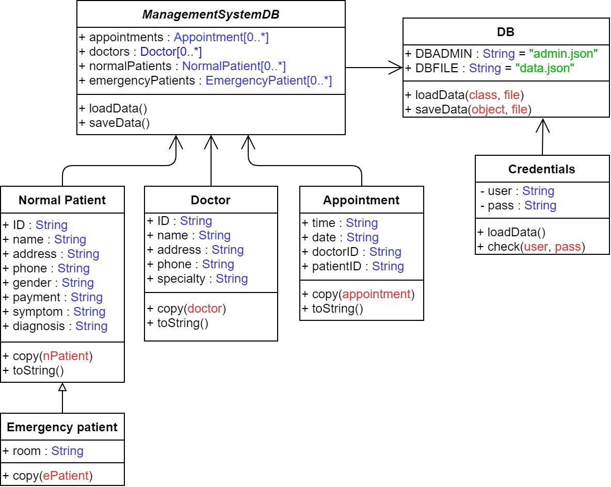
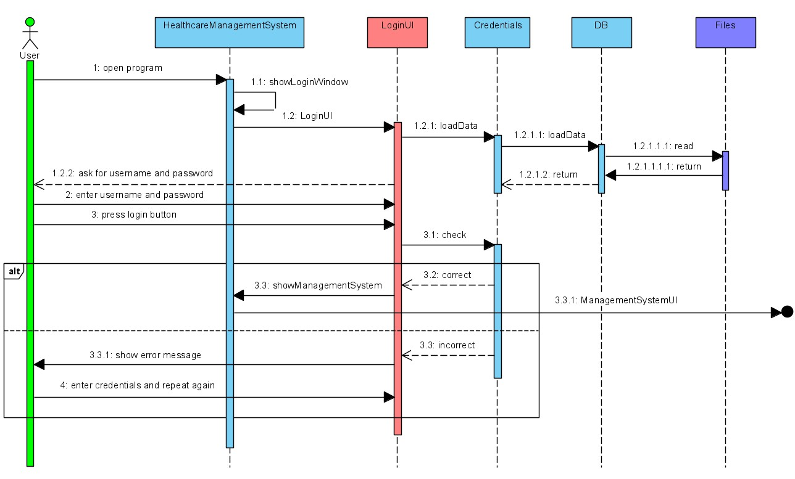
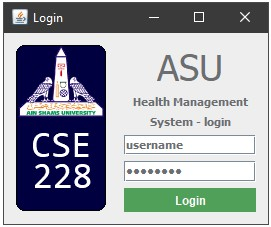
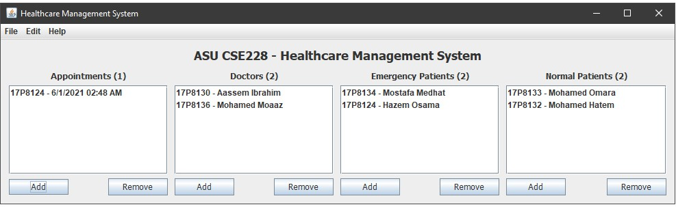
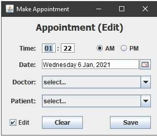
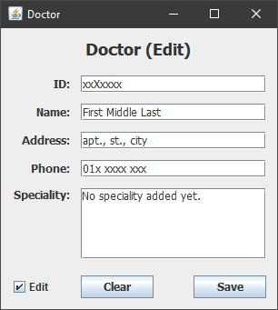
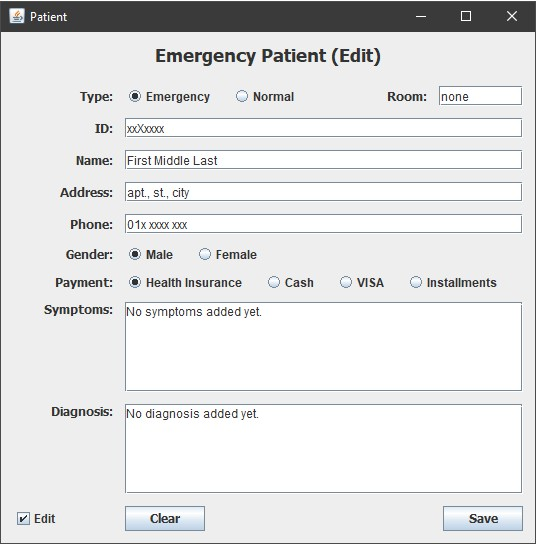

# healthcare-management-system
ASU - CSE 228 Project

# Using Java (Swing)

UML Design:

Login Sequence Diagram:

Login window:

Main window:

Appointment window:

Doctor window:

Patient window:

